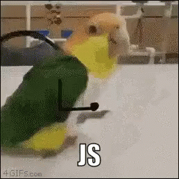

# Tópicos de programação com JavaScript

Aqui será tratados alguns tópicos importantes da programação com JavaScript. Bem como funções assíncronas, objetos e arrays e outros.

## Object e Arrays

- Podemos dizer que array é um conjunto de lista, terá vários itens.
  <pre><code>
    let list =[1,2,3,4,5]
  </code></pre>
- Já o object é a descrição desses itens
  <pre><code>
        let list = {
        name:"Jeremias",
        lastName:"Verissimo",
        age:20
    }
  </code></pre>

* E podemos ter sim uma lista de objetos

    <pre>
    <code>
      let person =[
        {
          name:"jeremias",
          lastName:"Verissimo",
          age:19
        }
        {
          name:"Adriano",
          lastName:"Norman",
          age:22
        }
        {
          name:"Henrique",
          lastName:"Gomes",
          age:11
        }
      ]
      </code>
  </pre>

  ## Mutação - Conceito 🧟

  Trata-se quando criamos um objeto em referência a outro. E, portanto, ao alterar essa referência, também irá alterar o o objeto original. A manipulação da referência de objeto também afetará o objeto referenciado. Portanto, cuidado!

  <pre><code>
    let list = [1,2]
    let copyList = list
  
    delete copyList[1] //será deletado o número 2
    console.log(list)//imprimirá [1, undefined]
  </code></pre>

## Mais método de JavaScript 
